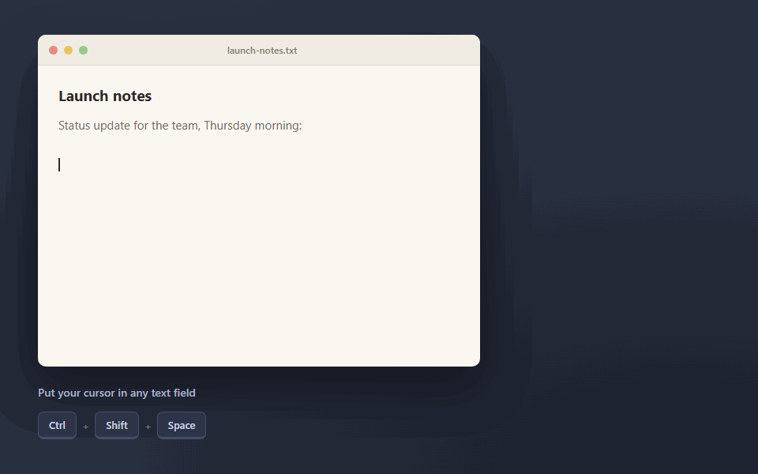

# Whisper Desktop

Push-to-talk dictation for your desktop. Hit a hotkey, talk, and the transcript lands wherever your cursor is. Whisper is magic and Groq's servers are fast enough that it feels instant, so I spent a weekend wiring the two into a tool I could speak into globally.

## Download

<p align="center">
  <a href="https://github.com/KernAlan/whisper-desktop/releases/latest/download/Whisper-Desktop-Windows-Setup.exe"></a><br><br>
  <a href="https://github.com/KernAlan/whisper-desktop/releases/latest/download/Whisper-Desktop-macOS-Apple-Silicon.dmg"></a><br><br>
  <a href="https://github.com/KernAlan/whisper-desktop/releases/latest/download/Whisper-Desktop-macOS-Intel.dmg"></a>
</p>

These always point to the latest release. You bring your own Groq API key. Enter it in **Settings** after installing.



## What it does

- `Ctrl+Shift+Space` to dictate into whatever field your cursor is in
- Say "Hey Whisper" for hands-free dictation, "Stop Whisper" to finish (optional, detection runs locally)
- `Ctrl+Shift+E` to rewrite selected text by voice: "make this shorter", "turn this into bullets"
- Optional polish pass that fixes punctuation and drops filler, or raw Whisper output if you'd rather have the speed
- A custom dictionary so it stops butchering your name and your project's jargon
- Long recordings get checkpointed and chunked automatically; failed ones are saved and retried instead of thrown away
- Your clipboard is preserved across inserts, and there's an **Undo Last Insert** if a paste goes somewhere it shouldn't
- A terminal CLI for changing models, hotkeys, and modes at runtime, plus a settings window if you don't want to memorize commands
- API key stored encrypted in the OS credential store

## Running from source

```
git clone https://github.com/kernalan/whisper-desktop.git
cd whisper-desktop
npm install
npm start
```

Then open **Settings** and enter your Groq API key under **Speech Service** (get one from the [Groq Console](https://console.groq.com/keys)). The key is encrypted with the OS credential store and never displayed again.

For development or managed environments you can use a `.env` file instead:

```
GROQ_API_KEY=your_api_key_here
# Optional (defaults shown)
APP_HOTKEY=CommandOrControl+Shift+Space
APP_COMMAND_HOTKEY=CommandOrControl+Shift+E
APP_HIDE_WINDOW_MS=5000
APP_DONE_HIDE_WINDOW_MS=900
APP_MEDIARECORDER_TIMESLICE_MS=150
APP_PREVIEW_INTERVAL_MS=2500
APP_DICTATION_MODE=polished
APP_WAKE_PHRASE_ENABLED=false
APP_PASTE_CHUNK_CHARS=1500
APP_PASTE_CHUNK_DELAY_MS=80
APP_CLIPBOARD_RESTORE_MODE=deferred
APP_CLIPBOARD_RESTORE_DELAY_MS=120
APP_LOG_FILE=logs/app.log
APP_LOG_MAX_FILES=3
APP_LOG_MAX_BYTES=2097152
GROQ_TRANSCRIPTION_MODEL=whisper-large-v3-turbo
GROQ_FALLBACK_TRANSCRIPTION_MODEL=whisper-large-v3
GROQ_TRANSCRIPTION_TIMEOUT_MS=5000
GROQ_TRANSCRIPTION_MAX_QUEUE=2
GROQ_TEXT_MODEL=llama-3.1-8b-instant
GROQ_TEXT_TIMEOUT_MS=20000
GROQ_POLISH_CHUNK_WORDS=450
GROQ_POLISH_MAX_WORDS=10000
```

A key saved through Settings takes precedence over `GROQ_API_KEY`; clear it and the app falls back to the environment key.

## Usage

Put your cursor in any text field, press `Ctrl+Shift+Space` (`Cmd+Shift+Space` on macOS), talk, and press it again. The transcript is pasted into the field you started from.

By default the transcript is lightly polished before pasting: content words are preserved, obvious filler and speech artifacts are dropped. If you want raw Whisper output with less latency, set `APP_DICTATION_MODE=fast` or run `set dictation fast` in the CLI.

**Wake phrase.** Enable it in Settings or with `node cli.js set wake on`, then say "Hey Whisper" to start dictating and "Stop Whisper" to finish. Detection runs locally. Ambient audio stays in memory on your machine, and nothing is sent to Groq until you've actually started dictating. A short pre-speech timeout cancels accidental activations, and the hotkey still works as the manual fallback.

**Long recordings.** Short dictations go up as one transcription request. Longer ones are persisted and transcribed as silence-aware checkpoints, then assembled before polishing. Recordings over 20MB are split to stay under the API size limit; recordings over `GROQ_POLISH_MAX_WORDS` skip the polish pass and paste raw. Long inserts are pasted in chunks, and your clipboard is saved once and restored at the end (set `APP_CLIPBOARD_RESTORE_MODE=off` if you'd rather keep the inserted text on the clipboard).

### Command mode

1. Select text in any app
2. Press `Ctrl+Shift+E` (`Cmd+Shift+E` on macOS)
3. Say what you want done, like "make this shorter" or "turn this into bullets"
4. Press the hotkey again to stop

The selection is replaced with the rewrite, using the model set by `GROQ_TEXT_MODEL`. If nothing was selected, your instruction is treated as a request to generate new text instead.

### Dictionary

If Whisper keeps getting a name, acronym, or product term wrong:

```
node cli.js dict add KernAlan
node cli.js dict
node cli.js dict remove KernAlan
```

Terms are stored locally and used as hints during transcription and command mode. `dict suggest` will propose terms from your recent transcripts.

### CLI

`npm start` drops you into an interactive console:

```
whisper> help
  status                     Show current config
  set model <name>           Change transcription model
  set text-model <name>      Change cleanup/command text model
  set dictation <mode>       fast | polished
  set wake <on|off>          Enable or disable the local wake phrase
  set hotkey <combo>         Change global shortcut
  set command-hotkey <combo> Change command-mode shortcut
  set injection <mode>       deferred | blocking | off
  set profile <name>         fast | balanced
  set timeslice <ms>         Recorder timeslice (min 50)
  set preview <ms>           Initial live preview delay (min 1000)
  set timeout <ms>           Transcription timeout (min 3000)
  set restore-delay <ms>     Clipboard restore delay
  refresh mic                Refresh microphone
  test mic                   Test microphone levels
  devices                    List audio inputs
  perf                       Performance stats
  settings                   Open settings window
  reset settings             Reset saved settings to .env/defaults
  last [n]                   Show last N transcriptions (default 1)
  copy-last                  Copy latest saved transcript to clipboard
  last-command               Show last command-mode run
  history                    List recent transcriptions
  dict                       List dictionary terms
  dict suggest               Suggest terms from recent transcripts
  dict add-suggested [n]     Add suggested terms
  dict add <term>            Add a dictionary term
  dict remove <term>         Remove a dictionary term
  recovery                   List saved recordings
  retry <latest|file|session> Re-transcribe saved audio
  quit                       Exit
```

The same commands work as one-shots against a running instance, which makes them scriptable from Stream Deck buttons or anything else:

```
node cli.js status
node cli.js set model whisper-large-v3
node cli.js set dictation fast
node cli.js set wake on
node cli.js set hotkey Ctrl+Shift+Z
node cli.js perf
node cli.js quit
```

Settings changed from the window or CLI are saved and survive restarts. `.env` is still the default source; `reset settings` goes back to it.

### Audio recovery

If a transcription fails (network error, timeout, API limit), the audio is saved instead of deleted and retried automatically. If the retry fails too, the overlay stays open with a retry button, and any partial text is copied to your clipboard.

```
whisper> recovery
  recording-2026-02-16T15-30-00.webm  4.2MB  2026-02-16 15:30:00

whisper> retry latest
  Transcription (342 chars):
  ...
```

Long recordings are saved as a single checkpoint session, so `retry latest` handles the whole thing without manual stitching. The recovery folder is capped at 10 sessions and pruned by age and size; audio from successful short dictations isn't retained at all.

### Diagnostics

The terminal shows the current config on startup, then logs the selected microphone, per-transcription pipeline latency (`preprocess`, `transcribe`, `polish`, `paste`, `restore`), and rolling `p50`/`p95` summaries every 10 runs. Daily logs (`app-YYYYMMDD.log`) go to the configured log directory.

### Platform notes

**macOS**: grant microphone access when prompted (System Preferences > Security & Privacy > Privacy > Microphone).

**Linux**: you'll need audio libraries and `xdotool` for selection capture and text insertion:

```
sudo apt-get install libasound2-dev xdotool
```

## Development

```bash
npm run check
npm test
```

Where things live:

- `cli.js`: terminal wrapper (interactive REPL and one-shot CLI)
- `src/main/main.js`: main process orchestration + IPC wiring
- `src/main/services/`: transcription pipeline, command-mode rewrites, dictionary, paste injection, credential storage, the named-pipe server the CLI talks to
- `src/main/services/wake-word-service.js`: sherpa-onnx keyword detector
- `src/renderer/renderer.js` + `src/renderer/core/`: state machine, device manager, audio engine, recorder, wake lifecycle
- `src/renderer/settings.js` + `settings.html`: settings window
- `src/shared/config.js`: runtime config parsing and validation

## Building

```
npm run build
```

Packages for your platform land in `dist`. The build bundles the small Apache-2.0 English wake model as an external resource so the native detector can read it without writing model data into the user profile.

## Troubleshooting

- Check the terminal logs first. Most failures show up there with a reason.
- If Windows grabs the wrong Bluetooth microphone, just start speaking once after connecting; the app refreshes its mic selection when devices change.
- If the CLI can't connect, the app probably isn't running (`npm start` or `npm run dev`).
- Transcription errors usually mean the Groq API key is missing or wrong.

## Roadmap

Maybe other providers (OpenAI, self-hosted Whisper), maybe transcription history. This was a weekend project, so no promises.

## License

Apache License 2.0. See the LICENSE file for details.
